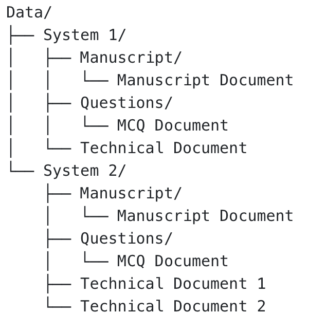

# 1 Dependencies
There are several dependencies for running different scenarios for this project. For running all scenarios Python, Docker and LibreOffice is required. An actual model is required for the Inference and Training scenario. CUDA dependency is optional.
## 1.1 Python
This assumes you have already downloaded the repo, navigated to its directory, having Python version 3.12 installed. First one should install all dependencies from the requirements.txt file. Being in a virtual python environment, this can be done using command from **1.6.1 Installation Requirements**. It is recommended to use a virtual environment to avoid conflicts with packages already installed on your local machine.

## 1.2 Docker
Another required dependency is docker. This is for the PostgreSQL database. Initialize or startup the PostgreSQL database using the docker compose yml file located in the ```postgres``` directory. This can be run using the command from **1.6.2 PostgreSQL Installation** (assuming current working directory is the root directory of the project.).

## 1.3 LibreOffice
A document editor tool is necessary for proper extraction of vital document information. Therefore, due to LibreOffice is open source and tested with our setup, this it is the recommended document editor. Download the appropriate file from this link: https://www.libreoffice.org/download/download-libreoffice/
## 1.4 Model Download
The model you want to use should be downloaded locally. Downloading of the models can be done using command from **1.6.3 Model Installation** in a python environment (after downloading all python dependencies).
Our solution is tested with these specific HuggingFace models: 

**Tested HuggingFace models:**

- [Llama-3.2-3B-Instruct](https://huggingface.co/meta-llama/Llama-3.2-3B-Instruct) - [https://huggingface.co/meta-llama/Llama-3.2-3B-Instruct](https://huggingface.co/meta-llama/Llama-3.2-3B-Instruct)
- [Qwen2.5-3B-Instruct](https://huggingface.co/Qwen/Qwen2.5-3B-Instruct) - [https://huggingface.co/Qwen/Qwen2.5-3B-Instruct](https://huggingface.co/Qwen/Qwen2.5-3B-Instruct)
- [Qwen2.5-7B-Instruct-1M](https://huggingface.co/Qwen/Qwen2.5-7B-Instruct-1M) - [https://huggingface.co/Qwen/Qwen2.5-7B-Instruct-1M](https://huggingface.co/Qwen/Qwen2.5-7B-Instruct-1M)

We can assume that other variants of these models in the specific "Qwen2.5" or "Llama-3.2" family would work as well.
## 1.5 CUDA
Optional dependency is the use of CUDA. Follow the link and download / setup CUDA for your specific environment. Link: https://developer.nvidia.com/cuda-downloads

## 1.6 Commands

**1.6.1 Installation Requirements**
```sh
pip install -r requirements.txt
```

**1.6.2 PostgreSQL Installation**
```sh
docker compose --file ./postgres/postgres-llmware.yml up  
```

**1.6.3 Model Installation**
```sh
huggingface-cli  
```


# 2 Configurations
Some pre configuration has to be done in order to properly set up the system for different run scenarios, explained further in Section **4 Run**.

## 2.1 Model
Configuration for running the different scenarios should be done in the ```config.json``` file. Main point to configure here is the model path. This can be done by changing the values of the following attributes ```model_repo_root```, ```tokenizer``` within the model specific dictionary element. Change the value to the math of where you downloaded the model you want to use. Model attributes ```qwen```, ```qwen1m```, ```llama``` represents models Qwen2.5-3B-Instruct, Qwen2.5-7B-Instruct-1M, Llama-3.2-3B-Instruct respectively. 


## 2.2 Initialization
Relative path of the root directory should be provided in the `path` variable in file `src/start.py` (for inference and training). For evaluation, results should be manually moved and organized system wise. All model generation outputs for each system being evaluated should be moved into the same directory.

# 3 Data
Relevant data this solution requires should be put in the specific order in accordance with structured  tree shown in the picture below. This data should be put in the provided `data` directory.



# 4 Run
We have three different run scenarios. These three scenarios are; running inference, running training and running evaluation. For inference and training, a lot of the same edits should be done. Running evaluation is done separately from the main entry point. 

## 4.1 Inference
Main entry point is `src/start.py`. For running inference, one should select the model you want to use. Select a model from the `models` variable and provide it to the `model` variable. Then select function `run` (comment out function `train`). Changing which system to run inference on is done in `src/pipeline.py`. More specifically, in the `run_all` method, change the `systems` variable to reflect which system you want to run inference on.

## 4.2 Training
For running training, alot of the same edits from Subsection **4.1 Inference** should also be used. Main difference is commenting out `run` function and running `train` function.

## 4.3 Evaluation
Main entry point is `src/metrics.py`. A requirement to run this is that inference has been done on at least one model for at least one system. The global variable `SYSTEMS` should be populated with the system names to evaluate. In the if name main block root directory should be specified in the `root_dir` variable, same as mentioned in Section **2 Configurations**. Path to the root output where the outputs have been organized should be specified in the `results_path` variable. Then select or deselect which evaluation function to run. 

